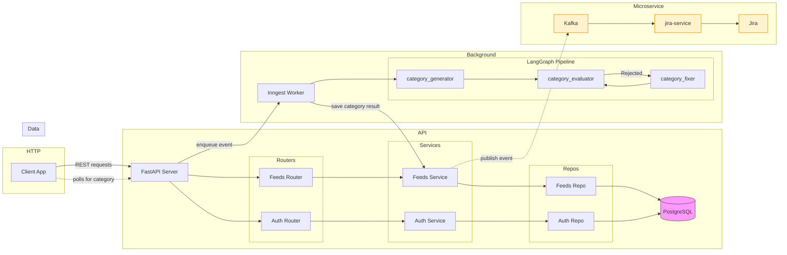
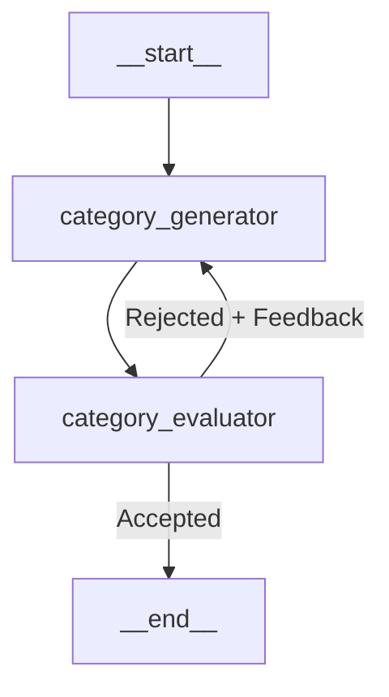

# feedIQ

feedIQ is a full-stack AI-powered product feedback platform built with modern technologies. The system features a React TypeScript frontend with Vite and TailwindCSS, a Python FastAPI backend with PostgreSQL database, and an advanced AI categorization pipeline using LangGraph with GPT-4o-mini and Claude Sonnet 4.6.

Users can submit feedback about applications, which is automatically categorized through a self-correcting multi-model pipeline processed asynchronously via Inngest background jobs. The platform employs a microservice architecture with a dedicated Node.js TypeScript Kafka consumer service that creates Jira tickets from categorized feedback, ensuring clean decoupling between the AI platform and external integrations.

**Key Technologies:**

- **Frontend:** React, TypeScript, Vite, TailwindCSS, TanStack Query, React Router
- **Backend:** Python, FastAPI, PostgreSQL, SQLAlchemy, Alembic
- **AI Pipeline:** LangChain, LangGraph, OpenAI GPT-4o-mini, Anthropic Claude Sonnet 4.6
- **Background Processing:** Inngest
- **Message Queue:** Kafka
- **Integrations:** Node.js, TypeScript, Atlassian REST API
- **Infrastructure:** Docker, Docker Compose

---

## Roadmap

| Feature                                     | Status  |
| ------------------------------------------- | ------- |
| User authentication                         | Done    |
| Feedback submission and listing             | Done    |
| AI categorisation pipeline                  | Done    |
| Kafka microservice + Jira integration       | Done    |
| AI feedback sentiment and priority pipeline | Planned |
| Duplicate feedback detection                | Planned |
| Sorting Feedbacks with AI                   | Planned |
| Comments on feedback                        | Planned |
| AI summarization of comments                | Planned |
| Filter feedbacks by category                | Planned |
| Edit and delete feedbacks                   | Planned |

---

## Demo

Demo of automatic categorization of user submitted feedback


https://github.com/user-attachments/assets/7892ca6e-b8c8-4ed3-9f6b-dbedc7aedbe2


---

## Repository Structure

```
client/       # Frontend web app (React + TypeScript + TailwindCSS + Vite)
server/       # Main backend API (Python + FastAPI + PostgreSQL + Inngest)
jira-service/ # Microservice for Jira ticket creation (Node.js + TypeScript + Kafka)
```

---

## Quickstart (Recommended)

The fastest way to run feedIQ locally is with Docker Compose.

Prerequisites: Docker and Docker Compose installed.

```bash
# From the server/ directory
cd server

# Copy and fill in environment variables
cp .env.example .env

# Start all services (server, client, db, inngest, kafka, jira-service)
docker-compose up --build
```

Then open http://localhost:5173

- API docs (Swagger UI): http://localhost:8000/api/v1/docs
- Inngest dashboard: http://localhost:8288

For manual setup without Docker, see Manual Setup below.

---

## Features

- User Authentication — register, login, and reset password with JWT-based sessions
- Feedback Management — submit feedback with title and description, view paginated list
- AI Categorisation — feedback is automatically categorised via a self-correcting LangGraph pipeline on submission
- Jira Integration — categorized feedback automatically creates tickets in Jira via a dedicated microservice
- Roadmap View — planned features and statuses

### Supported Categories

UI, UX, Bug, Feature, Enhancement, Performance, Documentation, Other, Uncategorized

Uncategorized is a system-reserved status assigned when the AI pipeline exhausts all retries without reaching a confident categorisation. It is never assigned by the LLM directly.

---

## 🏗 Architecture Overview



## AI Categorisation Pipeline

Feedback categorisation uses a self-correcting LangGraph pipeline that goes beyond a single-shot prompt:



- category_generator — proposes a category and reason for the feedback using GPT-4o-mini with structured output
- category_evaluator — strictly validates the proposal against the allowed categories and logical consistency
- If the evaluator rejects the proposal, it returns actionable feedback and the generator retries
- After 3 failed attempts, the feedback is marked as Uncategorized for manual review
- Both nodes use Pydantic-typed structured outputs via LangChain, ensuring type-safe and parseable LLM responses

The pipeline runs asynchronously — the API enqueues an Inngest event on feedback submission and returns immediately. The client polls for the category update and stops once it arrives.

---

## System Architecture & Flow

feedIQ is built like a well-organized team where each component has a specific role. Here's how the system works end-to-end:

### Data Flow

1. **User submits feedback** → Web app (React client) sends to FastAPI backend
2. **Server processes request** → Saves to PostgreSQL and enqueues AI categorization job via Inngest
3. **AI categorization runs** → LangGraph pipeline with GPT-4o-mini and Claude Sonnet 4.6 processes feedback asynchronously
4. **Feedback gets categorized** → Result saved back to database, client polls for updates
5. **Event published** → Kafka message sent for downstream integrations
6. **Jira ticket created** → Node.js microservice consumes event and creates ticket via Atlassian API

### Key Principles

- **Separation of Concerns**: Each service focuses on one task
- **Event-Driven**: Services communicate through Kafka messages, not direct calls
- **Asynchronous Processing**: AI categorization runs in background via Inngest
- **Scalable**: Can add more services or handle more users easily
- **Reliable**: Automatic retries and error handling throughout

---

## Tech Stack

| Layer           | Technologies                                                       |
| --------------- | ------------------------------------------------------------------ |
| Frontend        | React, TypeScript, Vite, TailwindCSS, TanStack Query, React Router |
| Backend         | Python, FastAPI, SQLModel, PostgreSQL, Alembic, SQLAlchemy         |
| AI Pipeline     | LangChain, LangGraph, OpenAI GPT-4o-mini, Anthropic Claude Sonnet 4 6                            |
| Background Jobs | Inngest                                                            |
| Message Queue   | Kafka                                                              |
| Integrations    | Node.js, TypeScript, Atlassian REST API                            |
| Infrastructure  | Docker, Docker Compose                                             |

---

## Notes

- Inngest API routes are registered but hidden from Swagger docs via a custom OpenAPI filter in server/src/main.py
- CORS is configured for http://localhost:5173 — update the origins list for other environments
- The OpenAPI schema is generated once and cached with no runtime overhead for normal requests
- Add new routers or workflows by creating them in server/src/ and registering them in main.py
- In the client, follow the features/\* pattern: components, hooks, and subcomponents grouped by feature

---

## 📚 Resources

- [FastAPI Documentation](https://fastapi.tiangolo.com/)
- [Inngest for Python](https://docs.inngest.com/)
- [LangGraph Documentation](https://langchain-ai.github.io/langgraph/)
- [Vite](https://vitejs.dev/)
- [React](https://reactjs.org/)
