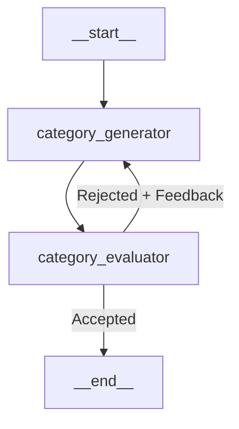
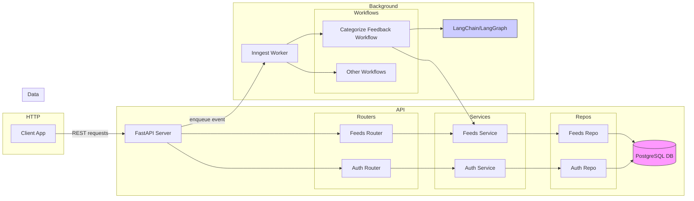

# feedIQ

feedIQ is a full-stack AI-powered product feedback platform. Users can submit feedback about an application, and the system automatically categorises it using a self-correcting LangGraph pipeline powered by OpenAI — all processed asynchronously in the background via Inngest.

                                           🚧 Work in progress 🚧 
---

## 🗂 Repository Structure

```text
client/    # Frontend (React + TypeScript + TailwindCSS + Vite)
server/    # Backend (Python + FastAPI + PostgreSQL + Inngest)
```

---

## 🚀 Quickstart (Recommended)

The fastest way to run feedIQ locally is with Docker Compose.

**Prerequisites:** Docker and Docker Compose installed.

```bash
# From the server/ directory
cd server

# Copy and fill in environment variables
cp .env.example .env

# Start all services (server, client, db, inngest)
docker-compose up --build
```

Then open **http://localhost:5173**

- API docs (Swagger UI): **http://localhost:8000/api/v1/docs**
- Inngest dashboard: **http://localhost:8288**

> For manual setup without Docker, see [Manual Setup](#-manual-setup) below.

---

## 📦 Features

- **User Authentication** — register, login, and reset password with JWT-based sessions
- **Feedback Management** — submit feedback with title and description, view paginated list
- **AI Categorisation** — feedback is automatically categorised via a self-correcting LangGraph pipeline on submission
- **Roadmap View** — planned features and statuses

### Supported Categories

`UI` · `UX` · `Bug` · `Feature` · `Enhancement` · `Performance` · `Documentation` · `Other` · `Uncategorized`*

> \* `Uncategorized` is a system-reserved status assigned when the AI pipeline exhausts all retries without reaching a confident categorisation. It is never assigned by the LLM directly.

---

## 🤖 AI Categorisation Pipeline

Feedback categorisation uses a self-correcting LangGraph pipeline that goes beyond a single-shot prompt:



- **category_generator** — proposes a category and reason for the feedback using GPT-4o-mini with structured output
- **category_evaluator** — strictly validates the proposal against the allowed categories and logical consistency
- If the evaluator rejects the proposal, it returns actionable feedback and the generator retries
- After **3 failed attempts**, the feedback is marked as **Uncategorized** for manual review
- Both nodes use Pydantic-typed structured outputs via LangChain, ensuring type-safe and parseable LLM responses

The pipeline runs asynchronously — the API enqueues an Inngest event on feedback submission and returns immediately. The client polls for the category update and stops once it arrives.

> See [Server Architecture](server/ARCHITECTURE.md) for the full system diagram and component breakdown.

---

## 🏛 Key Design Decisions

**Event-driven categorisation**
Categorisation is handled asynchronously via Inngest rather than blocking the HTTP request. This keeps API response times fast, makes the pipeline independently retryable, and decouples the AI processing layer from the web layer.

**Generator/Evaluator pattern**
Rather than relying on a single prompt, the pipeline uses a generator node to propose a category and a separate evaluator node to validate it. If rejected, the generator retries using the evaluator's specific feedback. This self-correcting loop improves accuracy and reduces hallucination compared to a single-shot approach.

**Structured outputs**
Both generator and evaluator use Pydantic models via LangChain's structured output feature. This ensures the LLM always returns type-safe, parseable responses rather than free-form text that requires fragile parsing.

**Layered backend architecture**
The backend follows a Router → Service → Repository pattern. Business logic lives in the service layer, database access in the repository layer, and HTTP concerns in the router. Each layer is independently testable and replaceable.

**Uncategorized fallback**
If the pipeline exhausts all retries and still cannot confidently categorise a feedback, it is marked `Uncategorized` rather than forcing an incorrect category. This preserves data integrity and provides a clear signal for manual review.

**Inngest for background jobs**
Inngest provides durable execution with automatic retries, step-level checkpointing, and a local dev dashboard. Each categorisation job is wrapped in `ctx.step.run` so that if the worker crashes mid-execution, completed steps are not re-run.

---

## 🏗 Architecture Overview



---

## ⚙️ Manual Setup

### Prerequisites

- Node.js v16+
- Python 3.10+
- PostgreSQL
- Docker (optional, for Inngest dev server)

### Backend

```bash
cd server
python -m venv .venv
source .venv/bin/activate
pip install -r requirements.txt
```

Create a `.env` file in `server/`:

```env
POSTGRES_USER=
POSTGRES_PASSWORD=
POSTGRES_DB=
POSTGRES_PORT=5432
POSTGRES_HOST=localhost
JWT_SECRET=
JWT_ALGORITHM=HS256
OPENAI_API_KEY=
INNGEST_DEV=1
INNGEST_BASE_URL=http://localhost:8288
```

Run migrations and start the server:

```bash
alembic upgrade head
uvicorn src.main:app --reload
```

### Frontend

```bash
cd client
npm install
```

Create a `.env.local` file in `client/`:

```env
VITE_API_BASE_URL=http://localhost:8000/api/v1
```

Start the dev server:

```bash
npm run dev
```

App runs at **http://localhost:5173**

---

## 🧪 Testing

Backend tests use pytest:

```bash
cd server
pytest
```

---

## 🛠 Tech Stack

| Layer | Technologies |
|---|---|
| Frontend | React, TypeScript, Vite, TailwindCSS, TanStack Query, React Router |
| Backend | Python, FastAPI, SQLModel, PostgreSQL, Alembic, SQLAlchemy |
| AI Pipeline | LangChain, LangGraph, OpenAI GPT-4o-mini |
| Background Jobs | Inngest |
| Infrastructure | Docker, Docker Compose |

---

## 💡 Notes

- Inngest API routes are registered but hidden from Swagger docs via a custom OpenAPI filter in `server/src/main.py`
- CORS is configured for `http://localhost:5173` — update the `origins` list for other environments
- The OpenAPI schema is generated once and cached with no runtime overhead for normal requests
- Add new routers or workflows by creating them in `server/src/` and registering them in `main.py`
- In the client, follow the `features/*` pattern: components, hooks, and subcomponents grouped by feature

---

## 📚 Resources

- [FastAPI Documentation](https://fastapi.tiangolo.com/)
- [Inngest for Python](https://docs.inngest.com/)
- [LangGraph Documentation](https://langchain-ai.github.io/langgraph/)
- [Vite](https://vitejs.dev/)
- [React](https://reactjs.org/)

