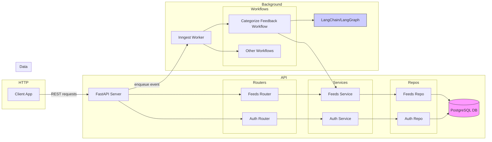

# Server Architecture

This document describes the backend architecture for `feedIQ`. It covers the key components, how they communicate, and includes a detailed Mermaid diagram visualizing the high-level design as well as the data/workflow flow for feedback categorization.

---

## 🔍 Overview

The server is built around **FastAPI**, providing **REST** endpoints for authentication and feedback management. It interacts with a PostgreSQL database and external services for background processing. The most important architectural piece is the integration with **Inngest** for running asynchronous workflows, particularly feedback classification using **OpenAI**,**LangChain**, and **LangGraph**.

### Core Components

- **FastAPI Application**: Entry point (`src/main.py`) that sets up routers, middleware (CORS), and the custom OpenAPI schema filter.
- **Routers & Services**:
  - `feeds`: handles create/read/list feedback operations via repository/service layers.
  - `auth`: user registration, login, and JWT management.
- **Database Layer**: SQLAlchemy models live in `src/db/models.py` and sessions managed via `src/db/session.py`.
- **Inngest Client & Workflows**: configured in `src/background_tasks` with workflows defined under `src/workflows`.
- **Third-party LLM Tools**: LangChain/LangGraph are utilized within workflows (e.g. `categorize_feedback.py`) to analyze feedback text.

---

## 📡 Execution Flow

1. **HTTP Request**: Client sends request to FastAPI endpoint.
2. **Business Logic**: Router --> Services --> Repository --> Database.
3. **Trigger Background Task**: For operations needing heavy processing (e.g. sentiment analysis), events are sent to Inngest.
4. **Inngest Workflow**: A worker picks up the job, executes `categorize_feedback` workflow which orchestrates LangChain and LangGraph calls, then writes results back to the database via Service class.

---

## 🔄 Detailed Architecture Diagram



This diagram highlights how the system is structured into three logical zones:

- **HTTP/API layer**: exposes endpoints and handles authentication and feedback CRUD operations
- **Data layer**: PostgreSQL holds application state
- **Background processing**: Inngest coordinates workflows.
- **AI Tasks**: LangChain and LangGraph performs LLM tasks.

---

## 🧩 File Map (selected)

```
server/src/
├── auth/
│   ├── router.py       # FastAPI routes for auth
│   ├── service.py      # business logic
│   └── model.py        # SQLAlchemy user model
├── feeds/
│   ├── router.py       # CRUD endpoints for feedback
│   ├── service.py
│   └── repo.py
├── background_tasks/
│   ├── client.py       # Inngest client instantiation
│   └── tasks/
│       └── categorize_feedback_bg.py  # helper for background call
├── workflows/
│   └── categorize_feedback.py  # workflow definition using LangChain
├── db/
│   ├── models.py
│   └── session.py
└── main.py
```

---

## 📈 Scaling & Performance

- **OpenAPI filtering**: schema generated once and cached; no runtime penalty.
- **Database connections**: use SQLAlchemy pooling.
- **Worker scalability**: Inngest workers can be scaled horizontally; jobs are idempotent.
- **Modular design**: new routers or workflows can be added without affecting existing ones.

---

## 📝 Further Reading
- refer to `server/src/workflows/readme.md` for workflow guidelines.
- Explore `server/tests` for integration test examples.
