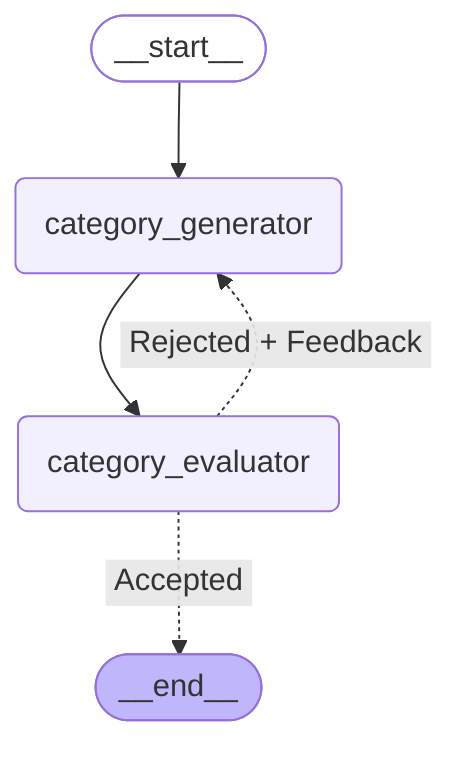

```mermaid
graph TD;
  __start__([<p>__start__</p>]):::first
  category_generator(category_generator)
  category_evaluator(category_evaluator)
  __end__([<p>__end__</p>]):::last
  __start__ --> category_generator;
  category_evaluator -. &nbsp;Accepted&nbsp; .-> __end__;
  category_evaluator -. &nbsp;Rejected + Feedback&nbsp; .-> category_generator;
  category_generator --> category_evaluator;
  classDef default fill:#f2f0ff,line-height:1.2
  classDef first fill-opacity:0
  classDef last fill:#bfb6fc
```